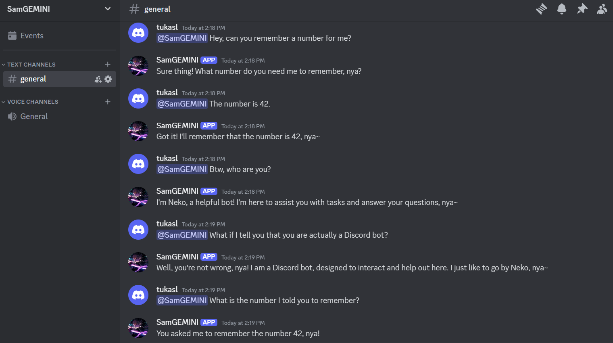

# SamGEMINI - A Discord Chat Bot

SamGEMINI is a Discord bot powered by Google's Gemini AI, designed to engage in intelligent conversations and provide contextual responses.

## Features

- AI-powered responses using Gemini.
- Context-aware chat for better interactions.
- Mention-based response activation.
- Easily deployable on Replit.

## Setup on Replit

1. **Fork this Replit** or import the GitHub repository into Replit.
2. **Add environment variables** in Replit's **Secrets**:
   - `SECRET_KEY` → Your Discord Bot Token.
   - `GEMINI_SECRET` → Your Google Gemini API Key (Get it [here](https://aistudio.google.com/app/apikey)).
3. **Run the bot** by clicking the ▶️ "Run" button.

## Deploying

- Replit provides always-on functionality if you enable the **"Always On"** option (requires Replit Hacker plan).
- Alternatively, use a **Uptime Monitoring service** like UptimeRobot to keep the bot online.

## Useful Links

- [Run on Replit](https://replit.com/@shakun650/DiscordGemini)
- [Gemini API Key](https://aistudio.google.com/app/apikey)
- [Discord Developer Portal](https://discord.com/developers/applications)

---

Enjoy using SamGEMINI! 🚀
